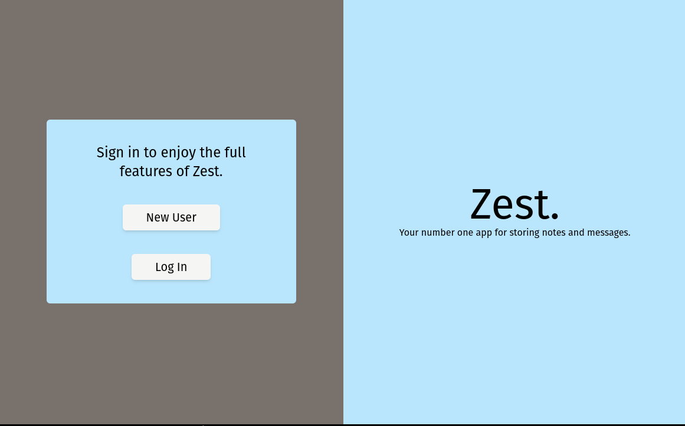
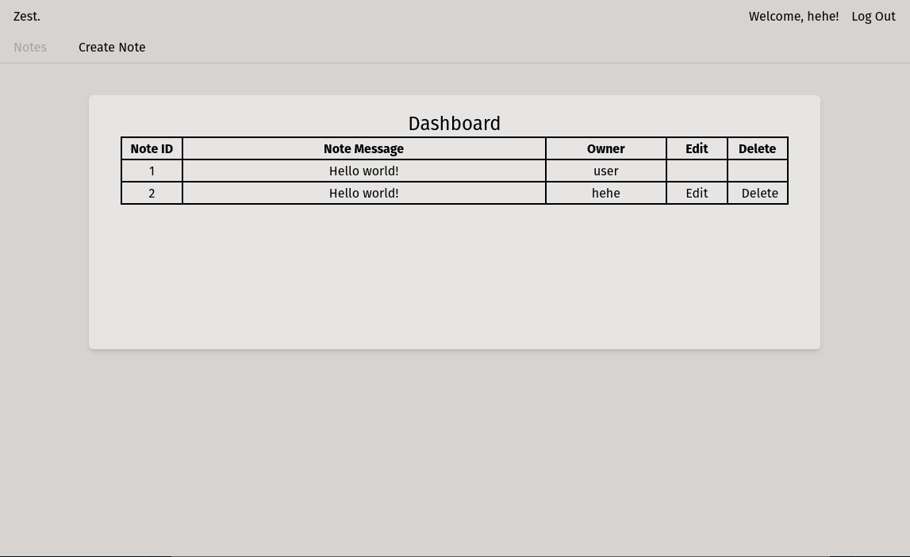

## Node CLI Shuttle Example
### Introduction
This is an example of what can be achieved by using [shuttle's](https://www.shuttle.rs) node CLI package to quickly bootstrap a Next.js application that uses Rust as a back end, complete with commands that integrate both sides together already built in.

We will be building a fully working login portal with a dashboard.

### Preview





### How To Use
You'll need Rust installed, as well as cargo shuttle. You can install cargo shuttle by running the following command:
```
  cargo install cargo-shuttle
```

You can also use binstall for the installation:
```
  cargo binstall cargo-shuttle
```

Note that this will require protoc due to a recent release change; you can see more about this [here.](https://github.com/shuttle-hq/shuttle/releases/tag/v0.12.0)

Once that's done, all you need to do is to install the dependencies on the root of the project and then log in with shuttle using `npm run shuttle-login`, then you can run this project locally or deploy it!

Note: Make sure you change the Shuttle.toml file to be a different project name otherwise you will get a 400 error.


### Packages/libs used
* Next: The whole point of this repo.
* React: The whole point of this repo (Next builds on React, so this is an unspoken pre-requisite).
* TailwindCSS: CSS.
* Autoprefix / PostCSS: CSS (TailwindCSS pre-requisites).

* shuttle_service: The whole point of this repo.
* shuttle_shared_db: Using shuttle's provisioned database.
* shuttle_secrets: shuttle secrets capabilities (environment variables).
* sync_wrapper: A wrapper for making async things, sync (default for deploying axum via shuttle)
* axum: A popular Rust web framework with easy to use syntax and highly compatible with tower-http middleware.
* axum_extra: An add-on library for axum. 
* tower_http: A Rust library for using many different types of middleware (rate limiting, auth, cors... etc) as well as easily making your own.
* bcrypt: Salted password hash encryption.
* lettre: A library for sending emails over SMTP.
* serde: A library for serializing and deserializing structs (required for Axum).
* rand: A random generator crate. We use this to generate session IDs but also can use it to generate random new strings, which is useful for password resets.
* sqlx: A library for working with databases and creating async connection pools.